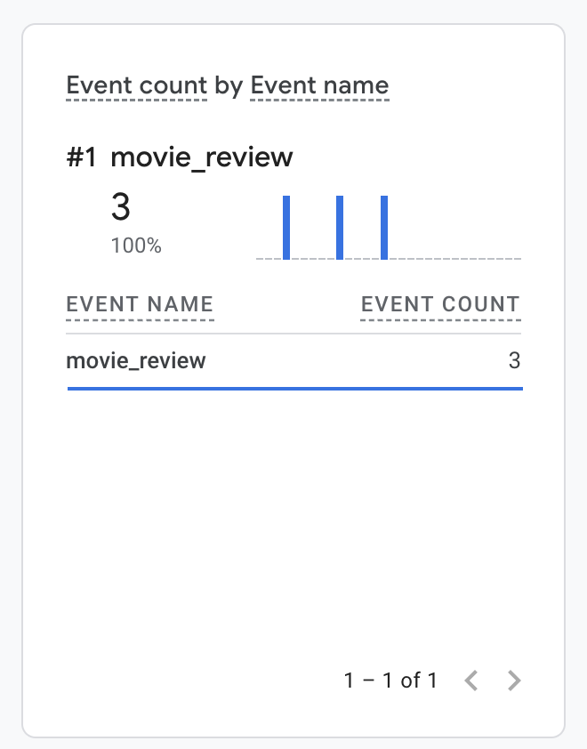

# WebAPI Assignment 4
**Author:** Elijah Heimsoth
**Class:** CSCI 3916 — Web API
**Date:** 04/05/26

## Description
A RESTful Movie API built with Node.js, Express, and MongoDB. This assignment extends Assignment 3 by adding a **Reviews** collection. Users can register, authenticate with JWT tokens, perform CRUD operations on movies, and post reviews. Movies and reviews are stored in separate MongoDB collections and joined at query time using the `$lookup` aggregation pipeline when `?reviews=true` is passed.

## Installation

```bash
git clone https://github.com/heimsothe/WebAPI-HW4.git
cd WebAPI-HW4
npm install
```

Create a `.env` file in the project root:
```
DB=<your MongoDB Atlas connection string>
SECRET_KEY=<your JWT signing secret>
PORT=8080
```

## Usage

Start the server:
```bash
npm start
```

Run tests:
```bash
npm test
```

### Authentication
1. `POST /signup` with `{ name, username, password }` to create an account
2. `POST /signin` with `{ username, password }` to receive a JWT token
3. Include the token in the `Authorization` header for all subsequent requests

## Deployed Endpoints
- **API:** [https://webapi-hw4-heimsoth.onrender.com](https://webapi-hw4-heimsoth.onrender.com)

## API Routes
| Route        | GET                                                  | POST                | PUT              | DELETE           |
| ------------ | ---------------------------------------------------- | ------------------- | ---------------- | ---------------- |
| /movies      | Return all movies                                    | Save a single movie | Not supported    | Not supported    |
| /movies/:id  | Return movie (+ reviews if `?reviews=true`)          | Not supported       | Update movie     | Delete movie     |
| /reviews     |                                                      | Create a review     |                  |                  |

All routes require JWT authentication. Obtain a token via `POST /signin`.

## Postman Collection
- [Collection JSON](Postman/CSCI3916_HW4.postman_collection.json)
- [Collection Postman Link](https://www.postman.com/elijah-heimsoth-6556435/csci-3916-web-api-spring-2026/collection/49915090-35794997-dfe6-4692-9131-924a54892640/?action=share&creator=0)
- [Environment JSON](Postman/HEIMSOTH%20-%20HW4.postman_environment.json)
- [Environment Postman Link](https://www.postman.com/elijah-heimsoth-6556435/csci-3916-web-api-spring-2026/environment/49915090-3a1545ec-71bb-4366-89da-0387c2c4dc7a/heimsoth-hw4?action=share&creator=0)


### Collection Details
| #   | Request                              | Method            | Expected Status |
| --- | ------------------------------------ | ----------------- | --------------- |
| 1   | Signup (random user)                 | POST /signup      | 200             |
| 2   | Signin (get JWT token)               | POST /signin      | 200             |
| 3   | Save a movie                         | POST /movies      | 200             |
| 4   | Get all movies                       | GET /movies       | 200             |
| 5   | Get movie (without ?reviews=true)    | GET /movies/:id   | 200             |
| 6   | Update a movie                       | PUT /movies/:id   | 200             |
| 7   | Error: Duplicate signup              | POST /signup      | 409             |
| 8   | Error: Missing movie fields          | POST /movies      | 400             |
| 9   | Error: Too few actors                | POST /movies      | 400             |
| 10  | Error: Nonexistent movie             | GET /movies/:id   | 404             |
| 11  | Error: No auth                       | GET /movies       | 401             |
| 12  | Post a review                        | POST /reviews     | 200             |
| 13  | Get movie with reviews               | GET /movies/:id   | 200             |
| 14  | Error: Review nonexistent movie      | POST /reviews     | 404             |
| 15  | Delete a movie                       | DELETE /movies/:id| 200             |

### How to Run
1. Import the Collection JSON and Environment JSON into Postman (or use the Postman links above)
2. Select the **HEIMSOTH - HW4** environment
3. Run the collection — all 15 requests should pass

## Extra Credit: GA4 Custom Analytics
Each time a review is posted via `POST /reviews`, a `movie_review` event is sent to Google Analytics 4 using the Measurement Protocol. The event includes the movie's genre, title, and review metadata as custom parameters.



[GA4 Report: movie_review Event Count](GA_Event_name_movie_review.pdf)
